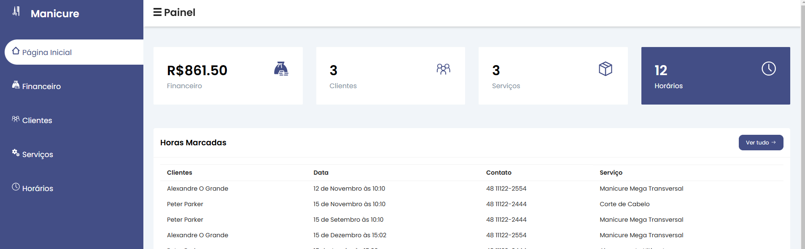

# :clipboard: Sobre
Este repositório foi desenvolvido, em grupo, como parte de um projeto acadêmico, com o objetivo de implementar um sistema para atender às necessidades de uma empresa ou comunidade, simplificando tarefas cotidianas. O sistema permite realizar o cadastro, consulta, edição e exclusão de informações relacionadas a clientes, serviços e agendamentos.

O projeto foi direcionado especificamente para atender uma manicure, que gentilmente aceitou utilizar o sistema em seu dia a dia. Isso possibilitou um estudo prático e realista das necessidades do usuário, permitindo que o sistema fosse projetado para resolver problemas reais e melhorar a organização das suas atividades.

  
   

### 🎯 Objetivo

- Facilitar a gestão diária: Automatizando o controle de clientes, serviços e agendamentos.
- Documentar o processo: Detalhar todas as etapas do projeto, desde a concepção até a implementação.
- Compartilhar experiências: Relatar os desafios enfrentados e as soluções adotadas durante o desenvolvimento.
- Obter feedback: Apresentar o sistema ao beneficiário e coletar insights sobre sua usabilidade e eficiência.

### 🛠️ Ferramentas Utilizadas

- ☕ Java: Linguagem principal utilizada para desenvolver a lógica de negócio da aplicação.
- 🌐 Spring Boot: Framework utilizado para criar os endpoints que conectam o front-end ao back-end.
- 🐳 Docker: Utilizado para o deploy da aplicação, garantindo isolamento e facilidade na execução do sistema.
- 🗄️ Banco de Dados PostgreSQL: Sistema de gerenciamento de banco de dados utilizado para armazenamento das informações, hospedado no serviço em nuvem Tembo.
- 🖥️ Front-end: Desenvolvido com HTML, JavaScript e CSS puro, sem a utilização de frameworks ou bibliotecas externas.

# 💻 Instalação e Execução

O sistema foi projetado para facilitar ao máximo o acesso. Abaixo, você encontra as instruções para utilizá-lo diretamente pelo link ou rodar o projeto localmente.

### ☁️ Acesso Rápido (Deploy)
O sistema completo já está hospedado. Basta acessar o link abaixo para utilizar:
- [https://manicure-projeto-de-extensao.vercel.app](https://manicure-projeto-de-extensao.vercel.app/index.html)

### 👨‍💻 Execução Local

Faça o clone do repositório, ou, se preferir, baixe o repositório como arquivo ZIP e o extraia.

#### Configurar e Executar o Back-end

2. Certifique-se de ter o Java 17+ instalado em sua máquina.
3. Compile e execute a pasta "manicure" dentro do projeto na IDE de sua preferência.

#### Executar o Front-end

1. Acesse a pasta "manicureFront" pelo Visual Studio Code.
2. Instale a extensão Live Server no VS Code.
3. Inicie o servidor local clicando em "Go Live" em qualquer arquivo html.
